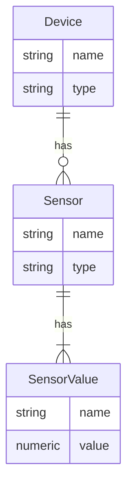

# Architecture

```mermaid
erDiagram
    Device {
        string name
        string type
    }

    Sensor {
        string name
        string type
    }

    SensorValue {
        string name
        numeric value
    }

    Device ||--o{ Sensor : has
    Sensor ||--|{ SensorValue : has
```
